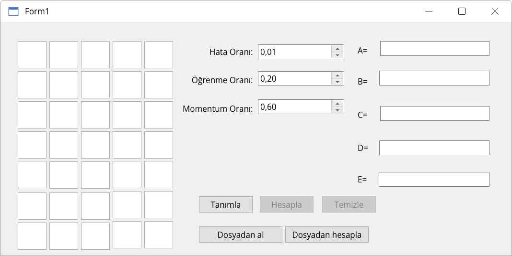
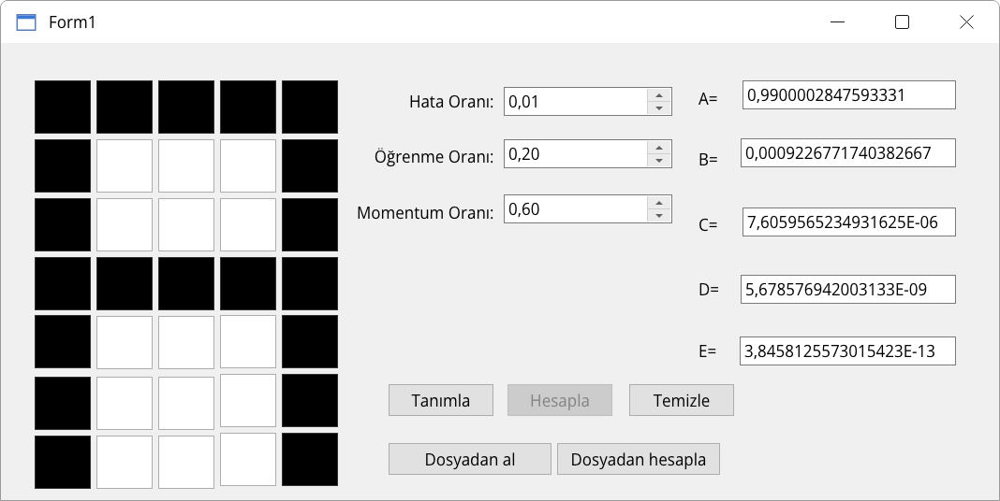
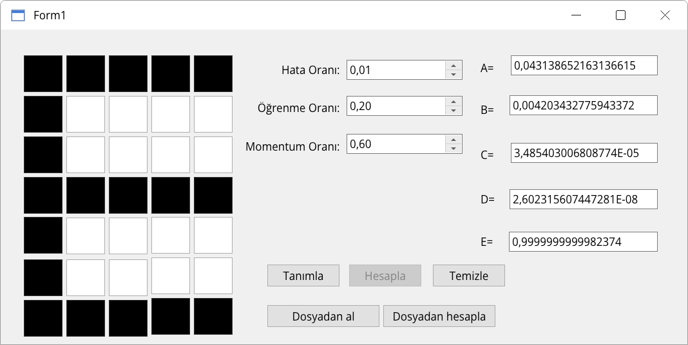

# Artificial Neural Networks Project

Artificial Neural Networks Project, C# ve Windows Forms kullanılarak geliştirilmiş temel bir yapay sinir ağı uygulamasıdır. Proje, kullanıcı tarafından oluşturulan **5x7 piksel harf desenlerini** tanımayı amaçlamaktadır.

## Özellikler

* 5x7 (35 hücre) çizim alanı
* A, B, C, D ve E harflerini tanıma
* Rastgele ağırlık oluşturma
* Oluşturulan ağırlıkları dosyaya kaydetme
* Kayıtlı ağırlıkları yükleyerek tahmin yapma
* Hata oranı, öğrenme oranı ve momentum değerlerini kullanıcı tarafından ayarlayabilme

## Ekran Görüntüleri

### Ana Ekran

Sol tarafta 5x7 çizim alanı, ortada eğitim parametreleri (varsayılan değerler: hata oranı `0,01`, öğrenme oranı `0,20`, momentum oranı `0,60`), sağda ise her harf için ağın çıkış değerleri yer alır. Uygulama ilk açıldığında **Hesapla** ve **Temizle** düğmeleri pasiftir.



### "A" Harfinin Tanınması

Hücrelere tıklanarak **A** harfi çizilir, ardından **Tanımla** ve **Hesapla** düğmelerine basılır. Ağ, A çıkışı için `≈ 0,99` değerini üretirken diğer harflerin çıkışları sıfıra yakındır.



### "E" Harfinin Tanınması

Aynı işlem **E** harfi için yapıldığında en yüksek çıkış değeri E satırında elde edilir.



## Kullanılan Teknolojiler

* C#
* .NET 7
* Windows Forms (WinForms)

## Proje Yapısı

```text
WinFormsApp1/
├── WinFormsApp1.sln
├── WinFormsApp1/
│   ├── Form1.cs
│   ├── YapaySinirAgi.cs
│   └── WinFormsApp1.csproj
screenshots/
├── ana-ekran.png
├── harf-a-tanima.png
└── harf-e-tanima.png
```

## Kurulum

### Gereksinimler

* Windows işletim sistemi
* .NET 7 SDK
* Visual Studio 2022 (veya üzeri)

### Adımlar

1. Repoyu klonlayın.

```bash
git clone https://github.com/kullaniciadi/Artificial-Neural-Networks-Project.git
```

2. Projeyi Visual Studio ile açın.

```text
WinFormsApp1.sln
```

3. Gerekli NuGet paketlerini geri yükleyin.

4. Projeyi **Build** edin ve **Start** düğmesine basarak çalıştırın.

Alternatif olarak terminal üzerinden:

```bash
dotnet run --project WinFormsApp1/WinFormsApp1/WinFormsApp1.csproj
```

## Ağırlık Dosyaları

Uygulama eğitim sırasında oluşturduğu ağırlıkları aşağıdaki dosyalara kaydedebilir ve daha sonra tekrar kullanabilir:

* `giris_katmani_agirliklari.txt`
* `ara_katmani_esik_agirliklari.txt`
* `cikis_katmani_esik_agirliklari.txt`
* `cikis_katmani_agirliklari.txt`

## Notlar

* Uygulama arayüzü Türkçe olarak geliştirilmiştir.
* Eğitim verileri A, B, C, D ve E harflerinden oluşmaktadır.
* Çizilen desenler yapay sinir ağı tarafından değerlendirilerek en uygun harf tahmini yapılmaktadır.

## Geliştirici

**hincim**
